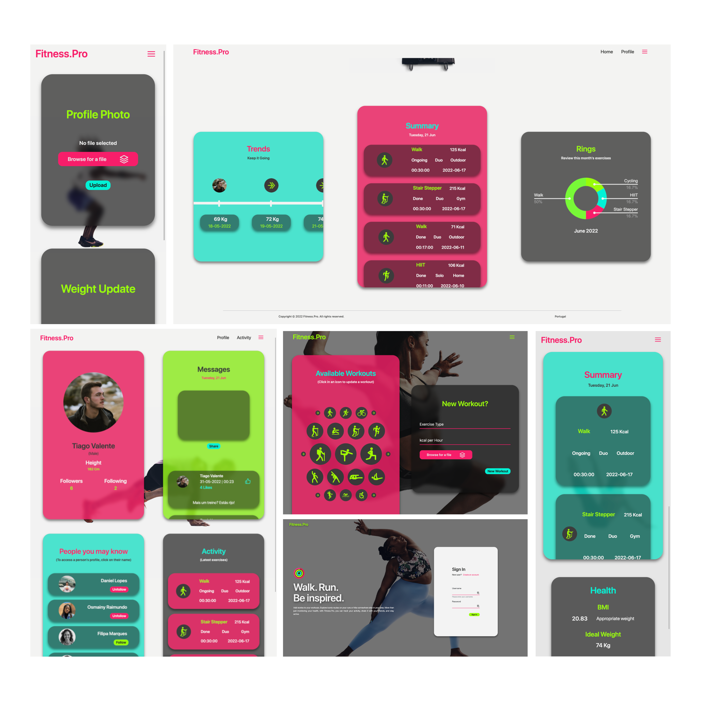
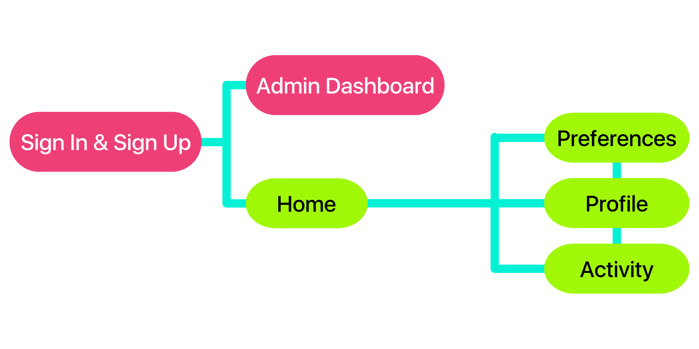
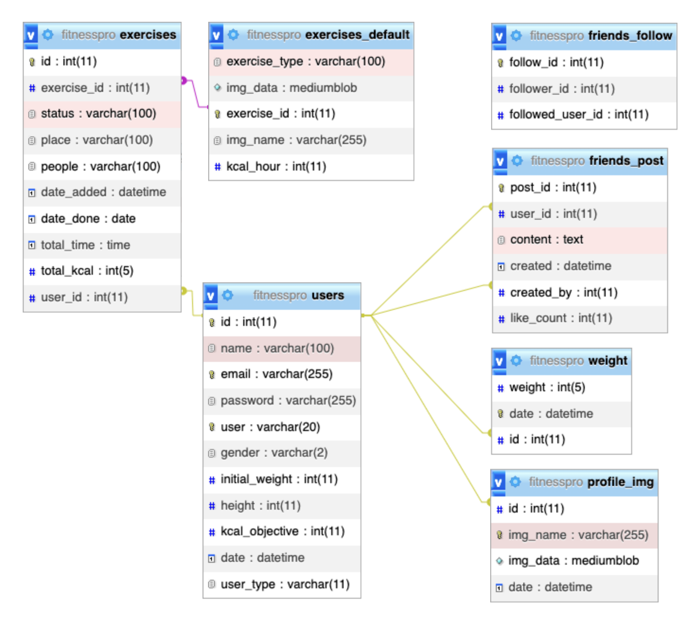

# Fitness.Pro 🏃 
     
<br>
<br>
Fitness.Pro is my Health tracker WebApp that records user activity, displays their history, and allows users to interact with one another. It releases  after 2 months of rigorous research and problem-solving. <br>
At first glance, PHP appeared to be a difficult scripting language, but it proved to be manageable and simple to use in the end. Fitness.Pro user's interface is particularly detailed and adheres to a set of design guidelines, demanding further work on my part to customize things. It's insane to imagine Fitness.Pro as my first-ever Web application right out of the blue.

### Try it yourself! 😄
Demo: <a href="https://fitnesspro.tvalente.ml/">Fitness.Pro</a>

## UI/UX 📱
### A containers world
The Fitness.Pro UI was designed to be pleasing to users while also being useful and responsive. Each feature is contained within a container with rounded corners and transparent backgrounds, and when the information does not fit within the default size, it is scrolled within the container. The user interface was created with the goal of being simple, organized, and human-friendly. Apple's design best practices were a source of inspiration.


## App Structure & Features 🛠️
<p align="center">
  
</p>

### Sign In & Sign Up
- If the user already has an account, they should Sign In; otherwise, they can Sign Up for free in just a few steps.

### Admin Dashboard
- Only administrators have access to the Admin Dashboard. Each account has a user type in the database that can only be changed in the db; the default when signing up is a `regular` type user. 
- The Administrator Dashboard is the webpage where you may update existing exercises and add new ones. The admin account in the Fitness.Pro database has the username admin and the password admin by default. It is possible to add more administrators in the future.

### Home
- After Signing In, the user is taken to the homepage (Social feed), where they can publish and like posts. A column on the right side of the screen (desktop version) lists all of the users who can be followed. The page's closing feature is the ability to view other people's height and exercises.

### Preferences
- This page is presently configured to just update a user's weight, as well as their profile photo and date. A new release may include new features.

### Profile
- The user has their own profile page where they can see their most recent exercises, their BMI and ideal weight, as well as their current weight and height. The user adds an exercise to this page by describing the date, time, status, people, and location.

### Activity
- User history is accessible in Activity, which includes prior weight measurements, each workout completed by the user, and a pie chart depicting the sort of activity performed every month by proportion.

## Programming Languages & Technologies

### Database 📁
The database for Fitness.Pro was managed using MySQL. There is a single database with seven tables. The Signed User id was recognized using foreign keys. 'exercises default' is one of the tables that records each exercise's icon, name, kcal per hour, and id.<br>

<p align="center">
  
</p>

### Frontend 💻
HTML, CSS, and JavaScript were used in the frontend. JQuery was also used in JS to hide and show divs on the same page, such as the Sign In and Sign Up divs. For the charts, Google API was used. AJAX and JSON were required to connect to the Fitness.Pro database in JavaScript. When the user clicked on a certain exercise and was routed to a page with information on that same exercise, AJAX was used to contact the PHP server. The PHP data was then encoded in JSON so that it could be managed in JavaScript and used in the pie chart.

### Cookies 🍪
Cookies are a useful tool for storing data and enhancing the user experience. Cookies are used by Fitness.Pro to handle the user's selected preferences. Cookies are then used to save a user's information on the homepage, provide information, and add a selected workout. Sign-Up cookies allow the user to dismiss the app's tab and return to have the Sign-Up option still active when they return.

```
if (!isset($_COOKIE['selected_user_id']) || !isset($_COOKIE['selected_user'])) {
    $_COOKIE['selected_user_id'] = $id;
    $_COOKIE['selected_user'] = $data['name'];
    setcookie('selected_user_id', $id);
    setcookie('selected_user',  $data['name']);
}
```


### Backend ⌨️
In the backend, a PHP server was used to hold all of the users' data, which was connected to a MySQL database. All inputs submitted when opening an account were sanitized, and passwords were hashed with the md5 algorithm to ensure the register kept the user's data private. If a user has previously logged in, PHP redirects them to the home page; if they haven't, they are directed to the Sign-Up page. It also checks whether the user is an admin or a `regular` user.


```
if (@$_POST['user'] && @$_POST['pass']) {
    $uuser = mysqli_real_escape_string($link, $_POST['user']); // sanitize string by removing special characters
    $upass = md5($_POST['pass']);
}

function successful()
{
    header('location:../home'); // redirect
}
```
## Suggestions
All suggestions are appreciated so that I can improve and optimize this app.
